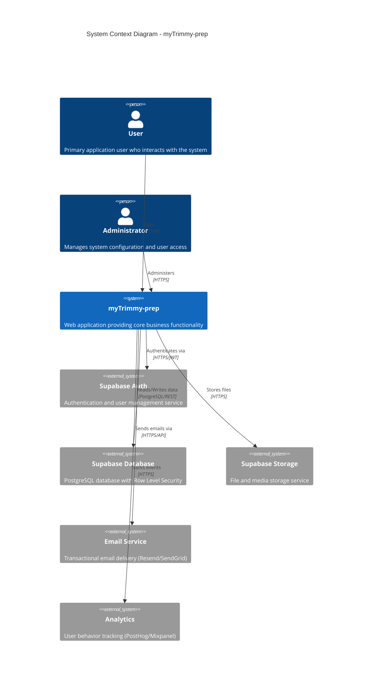
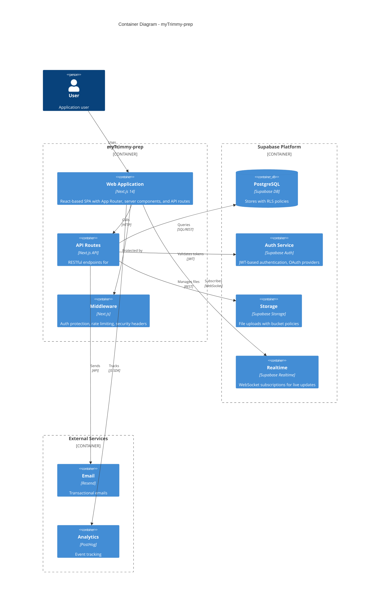
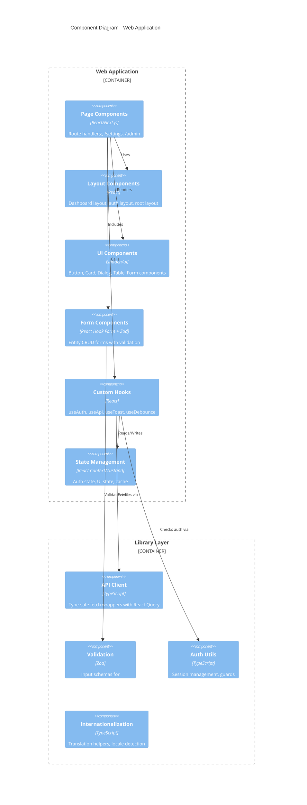
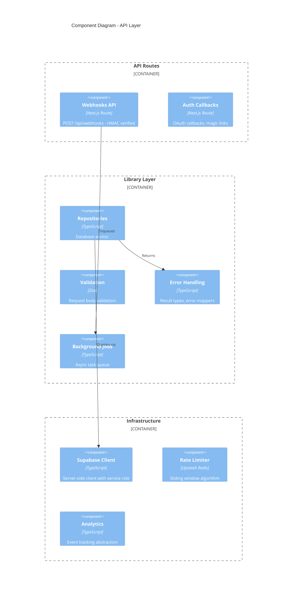
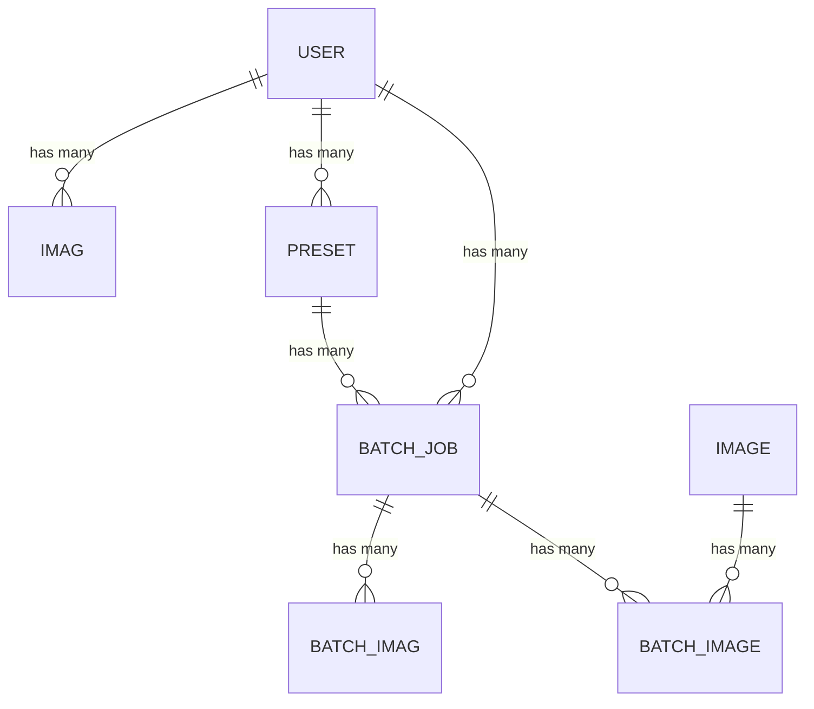
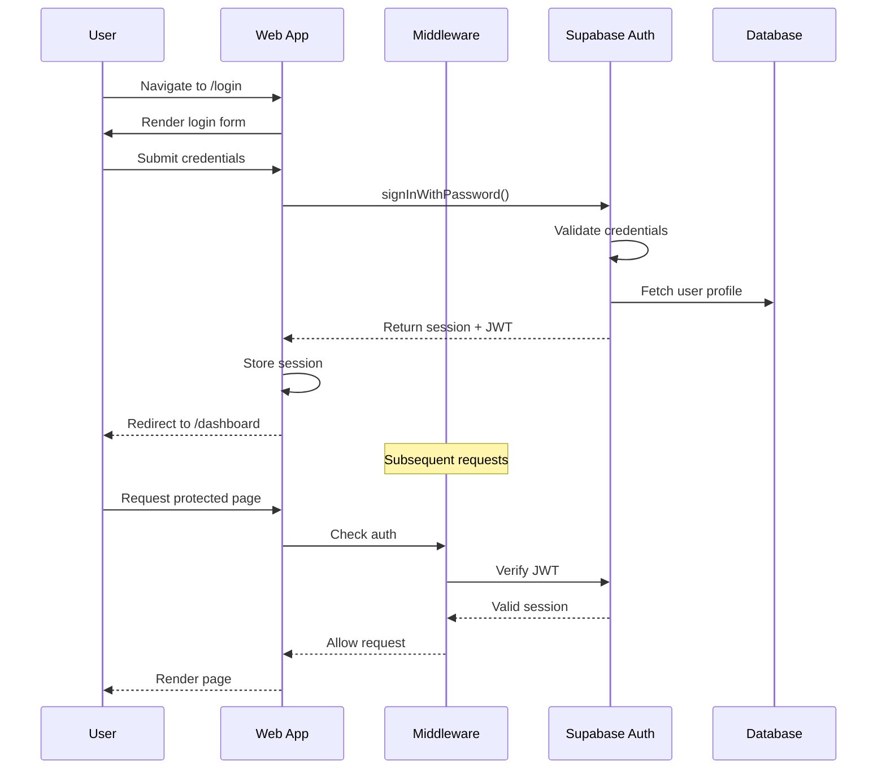
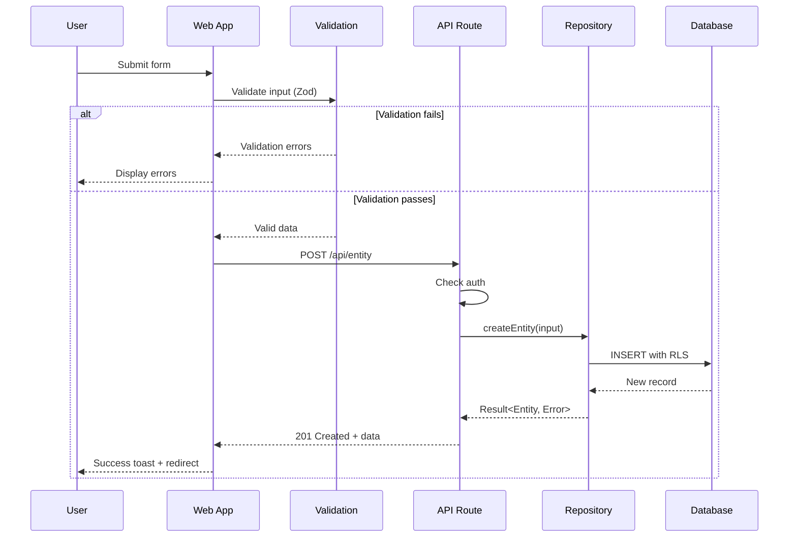
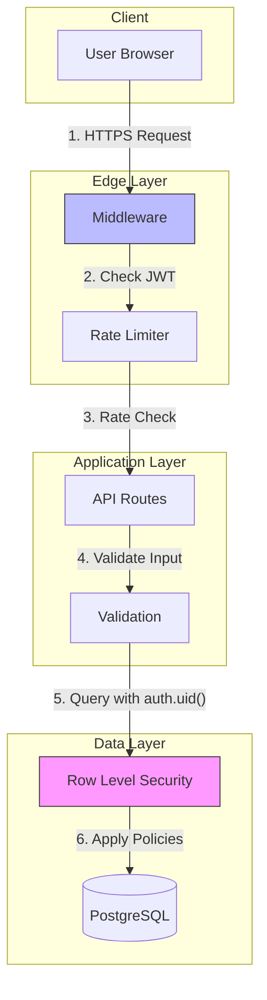
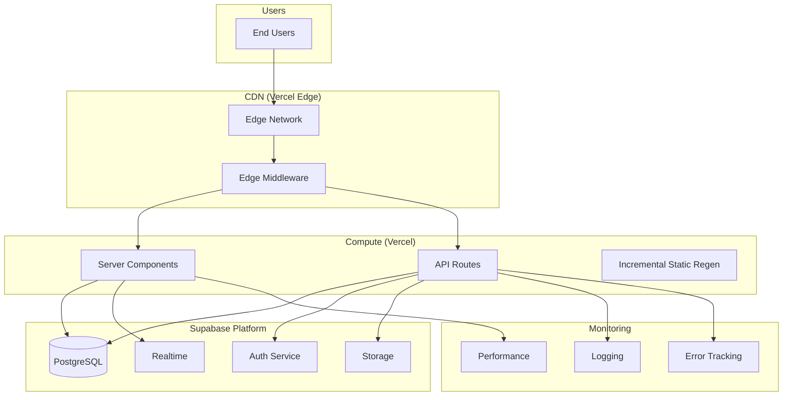

# Architecture Diagrams - myTrimmy-prep

Generated: 2026-01-14

---

## Overview

This document provides C4 model architecture diagrams for myTrimmy-prep using Mermaid syntax. The C4 model visualizes software architecture at four levels of abstraction: Context, Container, Component, and Code.

**Rendering:** These diagrams use Mermaid syntax. View them in:
- GitHub/GitLab (native support)
- VS Code with Mermaid extension
- [Mermaid Live Editor](https://mermaid.live)

---

## Level 1: System Context

The System Context diagram shows myTrimmy-prep and its relationships with users and external systems.



### Context Narrative

myTrimmy-prep is a web application that serves users and administrators. The system leverages Supabase for:

- **Authentication**: Secure user sign-up, login, and session management
- **Database**: PostgreSQL with Row Level Security for data isolation
- **Storage**: Secure file uploads with access control


---

## Level 2: Container Diagram

The Container diagram shows the high-level technical building blocks of myTrimmy-prep.



### Container Responsibilities

| Container | Technology | Responsibility |
|-----------|------------|----------------|
| Web Application | Next.js 14 + React | UI rendering, client-side state, server components |
| API Routes | Next.js API Routes | Business logic, validation, data access |
| Middleware | Next.js Middleware | Auth guards, rate limiting, headers |
| PostgreSQL | Supabase | Data persistence with RLS |
| Auth Service | Supabase Auth | User identity, sessions, OAuth |
| Storage | Supabase Storage | File management with policies |

---

## Level 3: Component Diagram

The Component diagram shows the internal structure of key containers.

### Web Application Components



### API Layer Components



### Component Inventory

| Layer | Component | Purpose |
|-------|-----------|---------|
| API | Webhooks | External event ingestion |
| Library | Repositories | Data access abstraction |
| Library | Validation | Input sanitization |
| Library | Error Handling | Consistent error responses |
| UI | Page Components | Route-based views |
| UI | Form Components | Data entry with validation |
| UI | UI Components | Reusable design system |

---

## Level 4: Code (Entity Relationships)

The Code level diagram shows the data model and entity relationships.

### Entity Relationship Diagram



### Domain Type Definitions

```typescript
// Branded ID types (prevent ID type confusion)

// Entity interfaces
```

### Relationship Summary

| From | To | Type | Foreign Key | On Delete |
|------|----|----- |-------------|-----------|
| Imag | User | many-to-one | user_id | CASCADE |
| Preset | User | many-to-one | user_id | CASCADE |
| BatchJob | User | many-to-one | user_id | CASCADE |
| BatchImag | BatchJob | many-to-one | batch_job_id | CASCADE |
| BatchJob | Preset | many-to-one | preset_id | CASCADE |
| BatchImage | Image | many-to-one | image_id | CASCADE |
| BatchImage | BatchJob | many-to-one | batch_job_id | CASCADE |

---

## Data Flow Diagrams

### User Authentication Flow



### Entity CRUD Flow



---

## Key Architectural Decisions

### 1. Authentication Strategy

**Decision:** Supabase Auth with JWT tokens

**Rationale:**
- Built-in RLS integration for data isolation
- OAuth provider support (Google, GitHub, etc.)
- Session management handled by platform
- Secure token refresh mechanism

### 2. Data Access Pattern

**Decision:** Repository pattern with Result types

**Rationale:**
- Explicit error handling (no thrown exceptions)
- Type-safe database operations
- Testable data layer
- RLS policies at database level

### 3. API Design

**Decision:** RESTful routes with typed contracts

**Rationale:**
- Standard HTTP methods (GET, POST, PATCH, DELETE)
- Consistent response format (`{ success, data, error }`)
- OpenAPI documentation
- Type generation from database schema

### 4. State Management

**Decision:** Server components + React Query for client state

**Rationale:**
- Minimize client-side JavaScript
- Automatic cache invalidation
- Optimistic updates where appropriate
- SSR-first approach


---

## Integration Points

### External Service Integration

| Service | Purpose | Integration Method | Error Handling |
|---------|---------|-------------------|----------------|
| Supabase Auth | User authentication | SDK + JWT | Redirect to login |
| Supabase DB | Data persistence | SDK + REST | Result type errors |
| Supabase Storage | File uploads | SDK | Upload retry logic |
| Email (Resend) | Transactional email | REST API | Queue for retry |
| Analytics | Event tracking | JS SDK | Fire and forget |

### Webhook Endpoints

| Endpoint | Source | Verification | Handler |
|----------|--------|--------------|---------|
| `/api/webhooks` | External services | HMAC signature | Event router |
| `/api/auth/callback` | OAuth providers | State parameter | Session creation |

---

## Security Architecture

### Authentication Layers



### RLS Policy Strategy

All tables with user data enforce Row Level Security:

```sql
-- Example: Users can only access their own data
CREATE POLICY "Users can view own data"
    ON entity
    FOR SELECT
    USING (auth.uid() = user_id);

-- Team access uses SECURITY DEFINER functions to avoid recursion
CREATE FUNCTION is_team_member(team_id UUID, user_id UUID)
RETURNS BOOLEAN AS $$
    SELECT EXISTS (SELECT 1 FROM team_members WHERE ...);
$$ LANGUAGE SQL SECURITY DEFINER STABLE;
```

---

## Deployment Architecture



### Environment Configuration

| Environment | URL Pattern | Database | Purpose |
|-------------|-------------|----------|---------|
| Development | localhost:3000 | Local/Branch DB | Feature development |
| Preview | pr-*.vercel.app | Branch DB | PR review |
| Staging | staging.*.com | Staging DB | Pre-production testing |
| Production | *.com | Production DB | Live users |

---

## Appendix: Diagram Legend

### C4 Diagram Shapes

| Shape | Meaning |
|-------|---------|
| Person | Human user or actor |
| System | Software system (yours or external) |
| Container | Deployable unit (app, database, etc.) |
| Component | Module within a container |

### Relationship Lines

| Line Style | Meaning |
|------------|---------|
| Solid arrow | Direct dependency |
| Dashed arrow | Async/eventual |
| Double line | Bidirectional |

### Entity Relationship Cardinality

| Symbol | Meaning |
|--------|---------|
| `\|\|` | Exactly one |
| `o\|` | Zero or one |
| `\|{` | One or more |
| `o{` | Zero or more |

---

*Generated by Mental Models SDLC - Architecture-First Design*
